# Complete Algorithm and Flowchart of the Research Work

## 1. Research Workflow Algorithm

**Algorithm: AI-Driven Early Prediction of Cardiovascular Disease**

**Input:** Cardio dataset, UCI Heart Disease dataset  
**Output:** Best predictive model, performance metrics, and validation results

1. Start.
2. Load the primary cardiovascular dataset (`cardio_train.csv`).
3. Perform dataset profiling:
   - record shape, columns, missing values, duplicates, and target distribution.
4. Clean the dataset using medical validity rules:
   - remove `id`,
   - convert age from days to years,
   - keep height within 120-220 cm,
   - keep weight within 30-200 kg,
   - keep systolic BP within 80-240,
   - keep diastolic BP within 40-160,
   - keep only records where systolic BP > diastolic BP.
5. Generate baseline features:
   - BMI,
   - pulse pressure,
   - mean arterial pressure,
   - age group,
   - blood pressure ratio.
6. Perform exploratory data analysis and visualization.
7. Split features and target variable.
8. Build preprocessing and machine learning pipelines.
9. Train baseline models:
   - Logistic Regression,
   - Random Forest,
   - Linear SVM,
   - Gradient Boosting.
10. Evaluate all baseline models using accuracy, precision, recall, F1-score, and ROC-AUC.
11. Select the best baseline model based on ROC-AUC.
12. Compare multiple train/test splits:
   - 70/30,
   - 75/25,
   - 80/20,
   - 85/15,
   - 90/10.
13. Identify the best split configuration.
14. Create advanced clinical and interaction features:
   - overweight and obesity flags,
   - blood pressure risk flags,
   - cholesterol and glucose risk flags,
   - lifestyle risk score,
   - metabolic risk score,
   - age-pressure interaction,
   - age-BMI interaction,
   - cholesterol-glucose interaction,
   - pressure load.
15. Retrain Gradient Boosting on the advanced feature set.
16. Apply GridSearchCV for hyperparameter tuning.
17. Evaluate the tuned model on the selected split.
18. Plot ROC curves and save comparison tables.
19. Validate the approach on the external UCI Heart Disease dataset.
20. Clean the UCI dataset and engineer baseline and advanced features.
21. Train and evaluate Gradient Boosting on the UCI dataset.
22. Compare external validation metrics with primary dataset results.
23. Report the best-performing model and final findings.
24. End.

## 2. Flowchart

```mermaid
flowchart TD
    A[Start] --> B[Load cardio_train dataset]
    B --> C[Profile dataset<br/>shape, missing values, duplicates, class balance]
    C --> D[Clean data using medical rules]
    D --> E[Engineer baseline features]
    E --> F[Exploratory data analysis and plots]
    F --> G[Prepare X and y]
    G --> H[Build preprocessing pipelines]
    H --> I[Train baseline models<br/>LR, RF, Linear SVM, GB]
    I --> J[Evaluate with Accuracy, Precision, Recall, F1, ROC-AUC]
    J --> K{Best baseline model?}
    K --> L[Gradient Boosting selected]
    L --> M[Compare train/test splits<br/>70/30 to 90/10]
    M --> N[Choose best split<br/>85/15]
    N --> O[Engineer advanced risk features]
    O --> P[Train GB with advanced features]
    P --> Q[Hyperparameter tuning using GridSearchCV]
    Q --> R[Evaluate tuned model and save ROC curves]
    R --> S[Load UCI Heart Disease dataset]
    S --> T[Clean and engineer UCI features]
    T --> U[Train and evaluate GB on UCI dataset]
    U --> V[Compare internal and external results]
    V --> W[Report final model and conclusions]
    W --> X[End]
```

## 3. Short Version for Paper or PPT

This research follows a structured machine learning pipeline for early cardiovascular disease prediction. First, the primary cardio dataset is collected, profiled, and cleaned using medically valid filtering rules. Next, baseline clinical features and derived health indicators such as BMI, pulse pressure, mean arterial pressure, and age groups are generated. Several machine learning models are then trained and compared, and Gradient Boosting is selected as the strongest baseline model.

After baseline evaluation, the work studies different train/test splits and finds the most effective data partition. Advanced risk-based and interaction features are then created to improve predictive power. Gradient Boosting is further optimized through GridSearchCV, and the final tuned model is evaluated using accuracy, precision, recall, F1-score, and ROC-AUC. Finally, the complete approach is validated on the UCI Heart Disease dataset to confirm the robustness and generalizability of the proposed method.

## 4. Presenter-Friendly Explanation

You can explain the work to viewers like this:

`First, we collected the cardiovascular dataset and removed medically invalid records. Then we created meaningful health features such as BMI, pulse pressure, and blood pressure ratios. After that, we trained several machine learning models and found that Gradient Boosting performed best. Next, we tested different train-test splits and added advanced risk-related features. We then tuned the best model using GridSearchCV to improve performance. Finally, we validated the entire framework on the UCI Heart Disease dataset to show that the method is reliable and generalizable.`

## 5. Main Results to Mention

- Best baseline model on the main dataset: Gradient Boosting with ROC-AUC of 0.8026.
- Best train/test split: 85/15 with ROC-AUC of 0.8040.
- Best tuned model on the main dataset: advanced-feature Gradient Boosting with ROC-AUC of 0.8052.
- External validation on UCI dataset: ROC-AUC of 0.9238.
